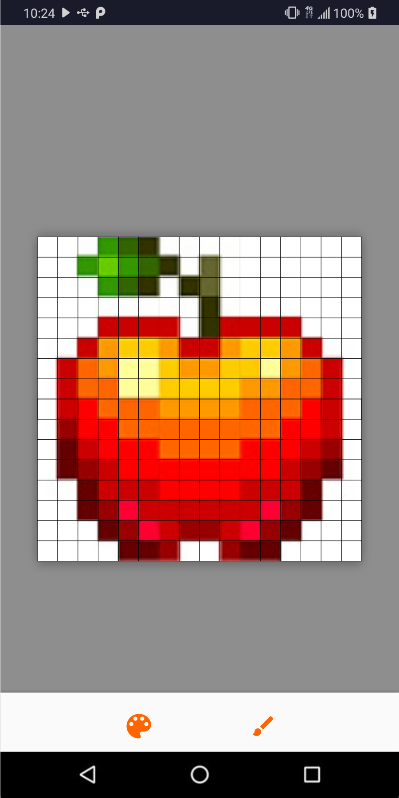

# Day #2: Pixelly

Today's app is a pixel art editor. Custom views are as fun as ever, and I learned how to use
`onSaveInstanceState` and `onRestoreInstanceState` inside of them this time. Note the use of
`LiveData<Event<...>>` in the `EditorViewModel` to prevent `DialogFragment`s from reappearing on
config change.

Project tech stack buzzwords:

 - Kotlin
 - Custom view
 - MVVM

